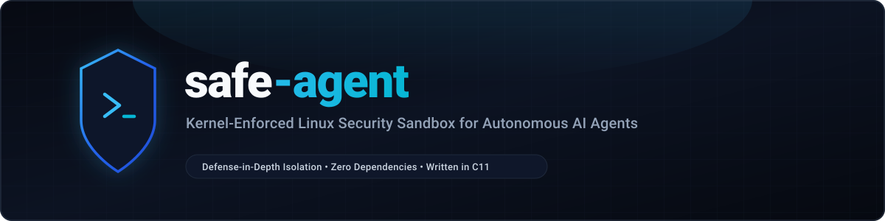

<p align="center">
  
</p>

<p align="center">
  <a href="LICENSE"></a>
  <a href="#requirements"></a>
  <a href="#build"></a>
  <a href="CONTRIBUTING.md"></a>
</p>

`safe-agent` is a Linux security sandbox binary designed for constrained AI agent command execution using Landlock LSM, seccomp-bpf, resource quotas, and unprivileged namespaces.

## Features

- **Filesystem Isolation (Landlock LSM)**: Restricts write, create, truncate, and unlink operations strictly to directories passed via `--allow-dir`. Supports multiple `--allow-dir` paths and read-only directory overlays via `--ro-dir`. Preserves read and execute access for system libraries and binaries (`/usr`, `/lib`, `/bin`, `/etc`, `/dev`).
- **Ephemeral In-Memory Mounts (`--tmpfs`)**: Mounts RAM-backed scratch filesystems (`tmpfs`) over specified directories in an unprivileged mount namespace. Files created during execution are discarded upon exit with zero disk persistence.
- **Syscall Filtering (seccomp-bpf)**:
  - `--block-net`: Installs a BPF filter intercepting and denying `socket`, `connect`, `bind`, and `socketcall` syscalls with `EPERM`.
  - `--harden-sys`: Traps high-risk kernel interfaces with `EPERM`, including `ptrace`, `process_vm_readv`, `process_vm_writev`, `userfaultfd`, `keyctl`, `bpf`, and `personality`.
  - `--block-tiocsti`: Traps `TIOCSTI` and `TIOCLINUX` `ioctl` commands to prevent terminal input injection sandbox escapes.
  - Validates system architecture (x86_64, aarch64, arm, i386, riscv64) and blocks x32 ABI evasion on x86_64.
- **Port-Level TCP Filtering (Landlock ABI v4+)**: Allows fine-grained outbound TCP connections via `--allow-net-connect <port>` and local socket binding via `--allow-net-bind <port>`. Denies all unlisted TCP ports by default.
- **Namespace Isolation**:
  - `--drop-net`: Unshares network namespace via `unshare(CLONE_NEWUSER | CLONE_NEWNET)`, isolating the command in a network stack with no network interfaces.
  - `--new-pid`: Unshares PID namespace via `unshare(CLONE_NEWUSER | CLONE_NEWPID)`, isolating the process table with the command running as PID 1.
- **Process Supervision & Timeouts**:
  - `--timeout <sec>`: Terminates the child process group via `SIGKILL` upon expiry, exiting with code 124.
  - Forwards `SIGINT` and `SIGTERM` signals to cleanly terminate all descendant processes.
- **Stream Output Quotas (`--max-output`)**: Pipes stdout and stderr through non-blocking supervisor monitors, terminating the process group with code 125 if aggregate output exceeds the specified byte quota.
- **Resource Limits & cgroups v2**:
  - `setrlimit`: Per-process virtual memory (`--max-mem <mb>`), CPU time (`--max-cpu <sec>`), process count (`--max-procs <n>`), and open files (`--max-files <n>`).
  - `--cgroup <path>`: Hierarchical resource bounding via cgroups v2 controllers (`memory.max`, `pids.max`).
- **Execution Telemetry (`--audit-log`)**: Emits structured JSON audit records containing wall-clock execution duration, CPU usage (`user_cpu_ms`, `sys_cpu_ms`), peak RSS (`max_rss_kb`), page faults, context switches, exit code, and active sandbox configuration.
- **Declarative Policy Profiles (`--profile`)**: Loads sandbox constraints from configuration files, simplifying invocation in automated pipelines.
- **Environment Sanitization**: `--clean-env` scrubs host environment variables, restoring a deterministic baseline `PATH=/usr/bin:/bin`. Specific variables can be preserved via `--keep-env KEY` or injected via `--env KEY=VAL`.
- **Privilege Boundary Enforcement**: Sets `PR_SET_NO_NEW_PRIVS` prior to applying filters and transferring control via `execvp`.

## Requirements

- Linux kernel >= 5.13 for Landlock filesystem isolation (kernel >= 6.5 for TCP port filtering).
- C11 compiler (GCC or Clang).
- GNU Make.

## Build

```bash
make
```

Binary target: `safe-agent`.

To run the automated test suite:
```bash
make test
```

To clean build artifacts:
```bash
make clean
```

## Usage

```bash
./safe-agent --allow-dir <path> [options] -- <command> [args...]
```

### Options

| Option | Description |
| --- | --- |
| `--profile <path>` | Load sandbox configuration options from a profile file. |
| `--allow-dir <path>` | Writable directory hierarchy (can be specified multiple times). |
| `--ro-dir <path>` | Read-only directory hierarchy (can be specified multiple times). |
| `--tmpfs <path>` | Mount ephemeral in-memory tmpfs over directory (can be specified multiple times). |
| `--allow-net-connect <port>` | Allow outbound TCP connection to port (Landlock ABI v4+). |
| `--allow-net-bind <port>` | Allow local TCP bind to port (Landlock ABI v4+). |
| `--block-net` | Block socket creation, bind, and connect via seccomp-bpf. |
| `--drop-net` | Unshare network namespace to an isolated stack with no network interfaces. |
| `--new-pid` | Unshare PID namespace with sandboxed command executing as PID 1. |
| `--block-tiocsti` | Block `TIOCSTI` and `TIOCLINUX` terminal injection `ioctl` calls. |
| `--harden-sys` | Block dangerous syscalls (`ptrace`, `process_vm_readv`, `keyctl`, `bpf`). |
| `--clean-env` | Clear all environment variables before running command. |
| `--env KEY=VAL` | Set environment variable inside sandbox (can be specified multiple times). |
| `--keep-env KEY` | Preserve specific host environment variable when `--clean-env` is active. |
| `--timeout <sec>` | Kill command process group if execution exceeds specified seconds. |
| `--max-output <bytes>` | Terminate process group if combined stdout/stderr output exceeds byte quota. |
| `--audit-log <path>` | Write structured JSON execution telemetry and resource accounting. |
| `--cgroup <path>` | Attach process group to specified cgroups v2 directory. |
| `--max-mem <mb>` | Limit virtual memory address space (`RLIMIT_AS`) in megabytes. |
| `--max-cpu <sec>` | Limit CPU process time (`RLIMIT_CPU`) in seconds. |
| `--max-procs <n>` | Limit process and thread count (`RLIMIT_NPROC`). |
| `--max-files <n>` | Limit maximum open file descriptors (`RLIMIT_NOFILE`). |
| `--` | Separator preceding target command and arguments. |

### Examples

Run an AI agent evaluation with isolated PID table, ephemeral `/tmp`, scrubbed environment, and telemetry logging:
```bash
./safe-agent --allow-dir /workspace --tmpfs /tmp --new-pid --harden-sys --clean-env --keep-env PATH --audit-log /workspace/run.json -- python3 eval.py
```

Execute an untrusted build with a 60-second timeout, 10MB output quota, and restricted memory:
```bash
./safe-agent --allow-dir /workspace --ro-dir /opt/toolchain --timeout 60 --max-output 10485760 --max-mem 2048 -- ./build.sh
```

Execute using a declarative policy profile:
```bash
./safe-agent --profile agent-runner.conf -- python3 main.py
```

Example `agent-runner.conf`:
```ini
# agent security baseline
allow-dir=/workspace
tmpfs=/tmp
drop-net
new-pid
harden-sys
block-tiocsti
clean-env
keep-env=PATH
timeout=120
max-mem=4096
max-output=5242880
audit-log=/workspace/audit.json
```

## Architecture

- `include/sandbox.h`: Interface definitions and configuration structures.
- `src/main.c`: CLI argument parsing, security boundary validation, and orchestration.
- `src/sandbox.c`: Landlock ABI version negotiation, bitmask fallback logic, and network port filtering.
- `src/seccomp_filter.c`: BPF filter construction for network denial, terminal injection defense, and syscall hardening.
- `src/env.c`: Environment sanitization and variable preservation logic.
- `src/supervisor.c`: Process supervision, process group termination, timeout enforcement, and output quotas.
- `src/rlimit.c`: Resource quota enforcement via `setrlimit`.
- `src/netns.c`: Unprivileged network namespace isolation (`CLONE_NEWNET`).
- `src/pidns.c`: Unprivileged PID namespace isolation (`CLONE_NEWPID`).
- `src/mountns.c`: Ephemeral in-memory tmpfs mount isolation (`CLONE_NEWNS`).
- `src/audit.c`: Structured JSON telemetry writer and rusage collector.
- `src/profile.c`: Declarative configuration profile parser and argument expander.
- `src/cgroup.c`: cgroups v2 controller setup and process attachment.
- `tests/`: Automated test suite covering CLI validation, seccomp filters, Landlock mock syscall routing, environment sanitization, process supervision, resource limits, namespaces, output quotas, telemetry, and profiles.

## Contributing

Contributions are welcome! Please read [CONTRIBUTING.md](CONTRIBUTING.md) for code conventions, testing requirements, and pull request procedures.

For security vulnerabilities and disclosure guidelines, refer to [SECURITY.md](SECURITY.md).

## License

MIT
